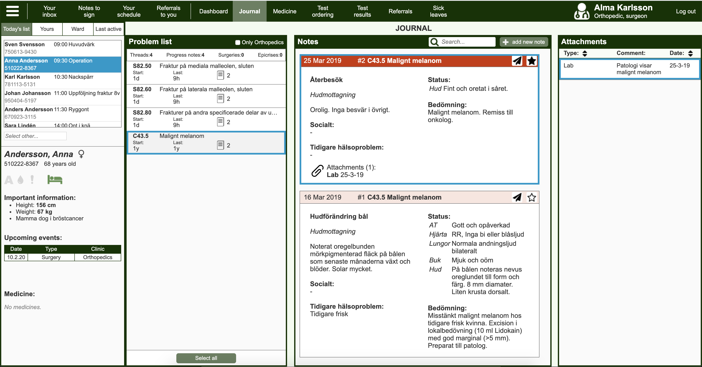

# EHR

## About
A medical journal UI prototype for orthopaedics that I implemented as part of my Master's thesis.

Demo available at: https://kallgren.github.io/ehr/#/journal 

### Built with
- Vue.js (Bootstrapped using the Vue CLI tool - `vue create` with Babel, Router, Vuex, Stylus, Linter / Formatter)
- Webpack
- Babel
- Stylus
- Eslint
- Prettier
- Editorconfig

### Prerequisites
- yarn

## Instructions
- Install dependencies: `yarn install`
- Run development server (with linting, hot reloading, etc.): `yarn serve`
